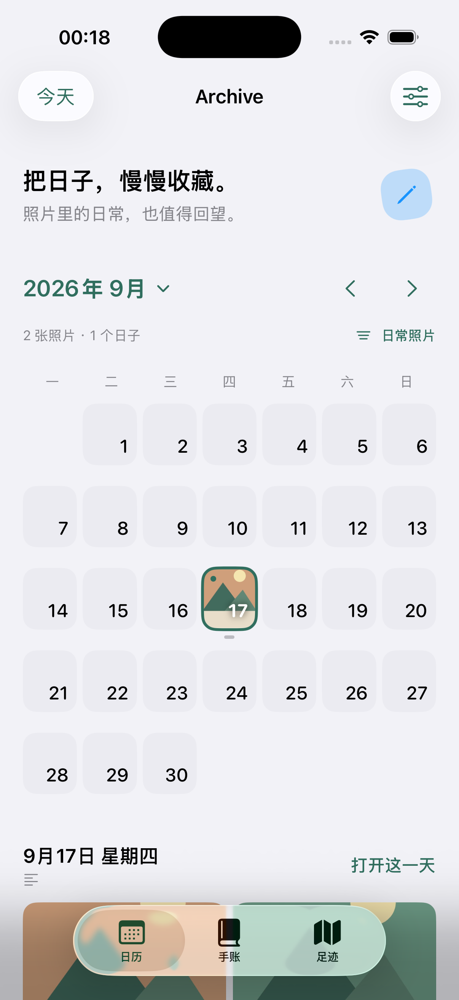
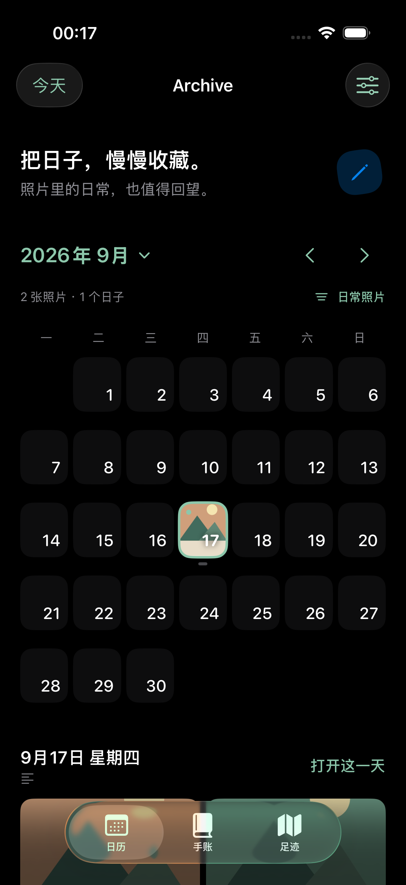

# Archive · 把日子，慢慢收藏

一个原生 iOS 照片日历与心情手账。SwiftUI + PhotoKit，无第三方依赖，无账户、无自建服务端。支持 iOS 17 及以上。

<p>
  
  
</p>

截图使用程序生成的测试图片，不包含个人照片。

## 0.2 版本

- **日历**：周一开始的月历，上一月 / 下一月、跨年日期跳转、回到今天；点日期查看摘要，再进入当天。
- **照片范围**：日常照片（不含截屏）、全部照片、已收藏、截屏。不再通过相机 EXIF 判断来源，因此下载、编辑过的图片也不会被悄悄遗漏。
- **当天**：照片网格、全屏左右翻页、双指 / 双击缩放、系统分享、收藏和删除。删除明确作用于系统相册，保留当天的手账。
- **手账**：九种带文字标签的心情、可清除心情、自动保存笔记、当天歌曲；搜索日期、心情、歌曲和笔记。没有照片也能记录。
- **足迹**：按照片已有位置聚合，点标记进入对应日期；不申请实时定位权限。
- **权限与错误**：主动授权、有限照片选择管理、拒绝权限后的设置入口、前台刷新、iCloud 加载失败重试、收藏和删除失败提示。
- **语音**：支持设备上的中文本地识别，接在已有笔记后面，不保存音频；不支持本地识别时可键盘输入。

保留原包名 `com.yuweiwei.photomoodarchive` 和 `archive.moods.v1`、`archive.notes.v1`、`archive.soundtracks.v1` 三组存储键，直接覆盖安装可继续使用旧记录。旧版代码在 `prototype-v0.1` 标签中。

## 打开和运行

1. 用 Xcode 打开 `PhotoMoodArchive.xcodeproj`，选择 `PhotoMoodArchive` scheme。
2. 选一个 iPhone 或 iPad 模拟器，运行。
3. 真机运行时在 Signing & Capabilities 中选择你自己的开发团队。不要卸载旧 App；使用相同包名覆盖安装以保留手账。

模拟器构建：

```sh
xcodebuild -project PhotoMoodArchive.xcodeproj \
  -scheme PhotoMoodArchive -sdk iphonesimulator \
  -derivedDataPath work/Build CODE_SIGNING_ALLOWED=NO build
```

## 验证

`ArchiveTests` 覆盖闰月、周起始、跨年、过滤、旧记录兼容、清空记录与真实 PhotoKit 元数据刷新。`ArchiveUITests` 覆盖月份切换、笔记重启后仍存在、心情设置 / 清除、翻图、收藏、删除确认的取消，以及实际删除后翻页与笔记保留。

请在**只含测试图片的模拟器**运行测试。PhotoKit 集成测试会创建一张测试图并修改其日期 / 收藏状态，不会改动其他照片。它需要相册完全访问权限；未授权时明确跳过。UI 测试预期今天有三张测试照片，并通过真实系统授权流程进入。最后一个 UI 测试会删除其中一张样例图，因此重跑前应在全新的测试模拟器重新导入三张图。

```sh
# 替换 SIMULATOR_ID；先给测试模拟器导入三张今天拍摄的测试图。
xcrun simctl addmedia SIMULATOR_ID test-1.jpg test-2.jpg test-3.jpg
xcodebuild -project PhotoMoodArchive.xcodeproj -scheme PhotoMoodArchive \
  -destination 'platform=iOS Simulator,id=SIMULATOR_ID' \
  -derivedDataPath work/Build -parallel-testing-enabled NO \
  -only-testing:ArchiveUITests CODE_SIGNING_ALLOWED=NO test
# UI 测试授权完成后，再运行包含 PhotoKit 的单元测试。
xcodebuild -project PhotoMoodArchive.xcodeproj -scheme PhotoMoodArchive \
  -destination 'platform=iOS Simulator,id=SIMULATOR_ID' \
  -derivedDataPath work/Build -parallel-testing-enabled NO \
  -only-testing:ArchiveTests CODE_SIGNING_ALLOWED=NO test
```

## 数据与边界

- 照片直接来自 Apple 照片图库。索引只读元数据，在后台队列处理，不扫描或下载每张照片的原始文件。
- 缩略图有 48 MB 内存缓存；任务离开屏幕后会取消图片请求。照片库变化后重读元数据，避免旧版只检查最新 40 张照片造成的遗漏。
- 心情、笔记、歌曲保存在本机 UserDefaults。没有跨设备同步或独立导出；卸载 App 会删除本地手账。使用设备备份保留记录。
- iCloud 原图预览与分享会使用网络；分享为最高约 2400 像素的图片，非无损原文件或 Live Photo。视频暂不纳入此照片日历。
- 地图由 Apple MapKit 提供。语音仅允许 on-device recognition，不支持时明确提示。
- 照片按设备当前时区归属日期；手账固定绑定记录时的本地日期。跨时区后照片的日期分组可能改变。
- 模拟器可以验证界面和本地照片流程；真机的 iCloud、语音识别、系统同步和大规模真实图库仍需实机体验。

详见 [交互与维护说明](UI_TUNING_GUIDE.md) 和 [验证记录](VALIDATION.md)。
